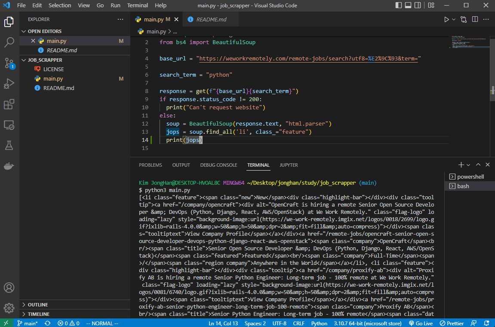

# job_scrapper
## nomadcoder's Python으로 웹 스크래퍼 만들기 Class

2022.10.05
Today I learned Python.

2022.10.12
Today I learned Python at home.
I want to run this at local. BUT selenium setting is so hard to me TT.
so I moved on this in replit.
https://replit.com/@jonghankim/webscrapper

----
로컬에서 하려고 했는데 역시 로컬셋팅은 힘들다;; 그냥 알려주는 대로 해야지...

